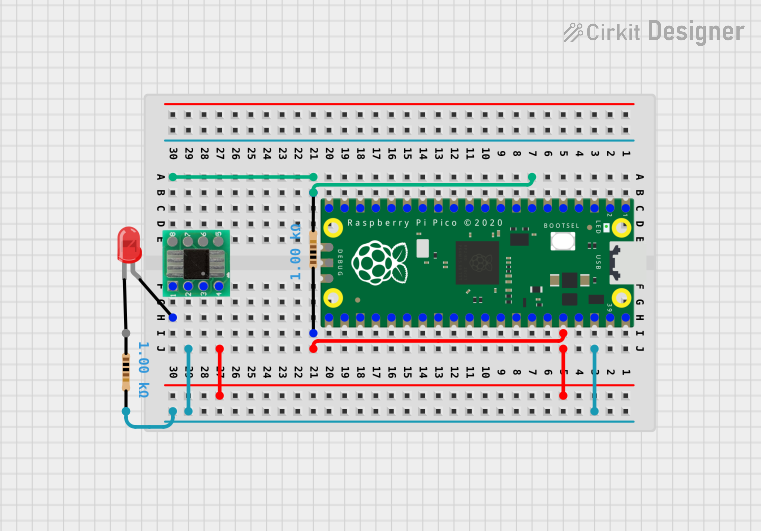

# Pico RISC-V Debugger
Turn your RP2040 into ch32v003 flasher/debugger. Based on project aappleby/picorvd (see [links](#links) below).

## Requirements

* [pico-sdk](https://github.com/raspberrypi/pico-sdk)
* `PICO_SDK_PATH` environment variable
* FreeRTOS Kernel
```shell
git clone -b smp https://github.com/FreeRTOS/FreeRTOS-Kernel --recurse-submodules
```
* `FREERSTOS_KERNEL_PATH` environment variable (optional)


## Getting started

0. Connect pin PD1 on your CH32V device to the Pico's SWIO pin (defaults to pin GP5), connect CH32V ground to Pico ground, and add a 1Kohm pull-up resistor from SWIO to +3.3v.




1. Build debugger.
```shell
mkdir build
(cd build && cmake .. && make pico_rvd)
```


2. Flash it to pico.

Copy `build/pico_rvd.uf2` to RPI-RP2

or run command
```shell
(cd build && make pico_rvd---deploy)
```

_Steps 1 and 2 required only once._


3. Build ch32v003 blink example and flash it.
```shell
(cd examples/blink && make)
```

## Console
Pico detects as two ttyACMx devices. First one is debugger console. Connect via
```shell
minicom -D /dev/ttyACM0
```
or
```shell
tio /dev/ttyACM0
```
and type "help" to get list of commands.

## Links
* https://github.com/aappleby/picorvd
* https://github.com/cnlohr/ch32v003fun
